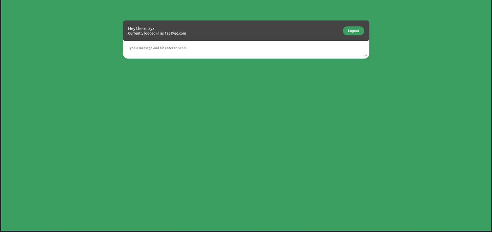
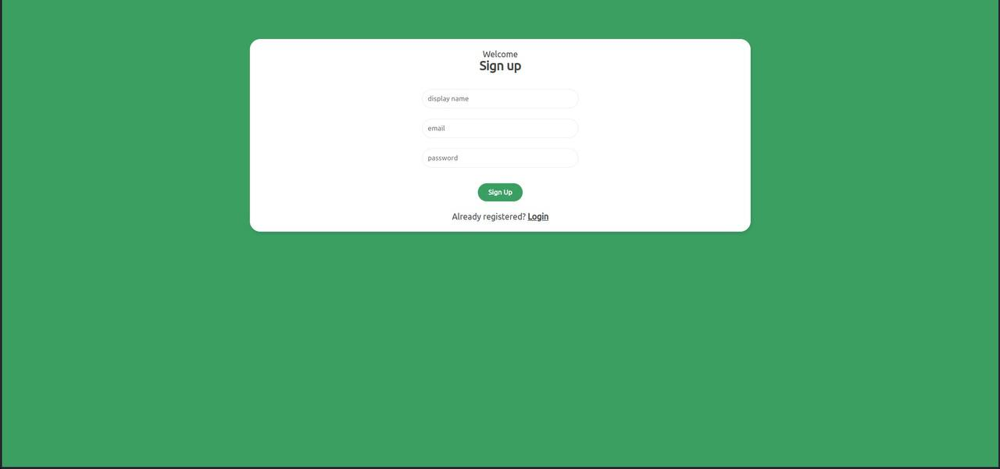
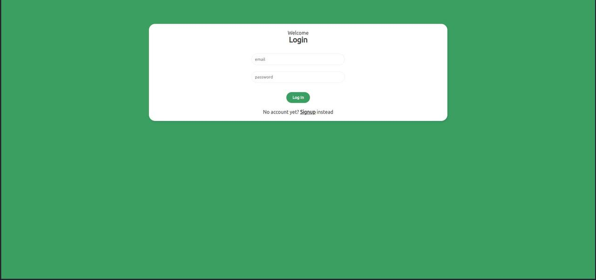

# vue-live-chat-room

## Deployed Version
```
https://vue-chat-room-46d74.web.app/
```

## Project Images
```



```

## Project setup
```
npm install
```

### Compiles and hot-reloads for development
```
npm run serve
```

### Compiles and minifies for production
```
npm run build
```

### Customize configuration
See [Configuration Reference](https://cli.vuejs.org/config/).
